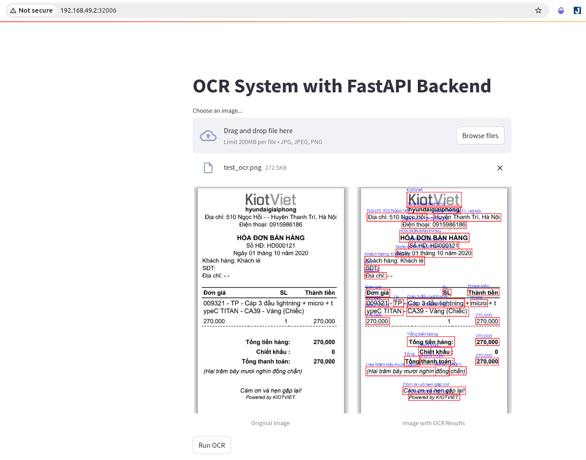

# OCR App



**Overview of the OCR App** 

The OCR system is a full-stack application, designed for processing and extracting text from images using a FastAPI backend and a Streamlit frontend. The system is fully containerized using Docker and deployed on a Kubernetes by minikube.  🚀

## 🛠️ Features
- **📂 Upload Documents**: Easily upload image within the app.
- **🤖 OCR Interface**: Using model by EasyOCR Framework for text detection and text recognition .

## 🖥️ Tech Stack

The Document Buddy App leverages a combination of cutting-edge technologies to deliver a seamless and efficient user experience. Here's a breakdown of the technologies and tools used:

- **[EaseOCR Framework](https://github.com/JaidedAI/EasyOCR)**: Provide a complete pipeline for the task of text detection and text recognition.
  
- **[Docker](https://www.docker.com/d)**: Packages applications for ease of deployment.
  
- **[FastAPI](https://fastapi.tiangolo.com/)**: Serving OCR model .
  
- **[Minikube](https://minikube.sigs.k8s.io/docs/start/?arch=%2Flinux%2Fx86-64%2Fstable%2Fbinary+download)**: Minikube is a lightweight Kubernetes implementation that allows developers to run a Kubernetes cluster locally on their machine. It is an excellent tool for development and testing, offering all the core Kubernetes components in a single-node environment.

- **[Streamlit](https://streamlit.io/)**: The core framework for building the interactive web application, offering an intuitive interface for users to upload image and visualize result of OCR.

## Prerequisites

Make sure your local machine has Docker and minikube installed.
- Docker: [Install docker for ubuntu](https://docs.docker.com/engine/install/ubuntu/)

- minikube: [Install minikube](https://minikube.sigs.k8s.io/docs/start/?arch=%2Flinux%2Fx86-64%2Fstable%2Fbinary+download)


## 🚀 Getting Started
Follow these instructions to set up and run the OCR App on your local machine.

### 1. Clone the Repository 
```bash
git clone https://github.com/ngothanhnam0910/Deploy-OCR-app-to-K8s.git
cd Deploy-OCR-app-to-K8s
```

### 2. Reproduce docker image

I have packaged both the backend and frontend code with docker and pushed these docker images to my dockerhub. You can directly use it for this project

But if you want to rebuild your own docker image, follow these steps:
```bash
frontend:  cd frontend && docker build -t image_name .
backend: cd backend && docker build -t image_name .
=> If you build successful, you need push them to your dockerhub for deploy to k8s.
```
### 3. Deploy to k8s

We will divide it into 2 deployments, one for the frontend and two for the backend.

- be_deployment.yaml: Includes configuration of frontend deployment and service k8s 
- fe_deployment.yaml: Includes configuration of backend deployment and service k8s

Run the following 2 commands

```bash
kubectl apply -f fe_deployment.yaml
kubectl apply -f be_deployment.yaml
```

### 4. Check application 
- If you want to check the API, you can go to the following link from your browser:  [http://192.168.49.2:32005/docs](http://192.168.49.2:32005/docs)
- You can access the OCR app's interface via a link from your browser:  [http://192.168.49.2:32006/](http://192.168.49.2:32006/)